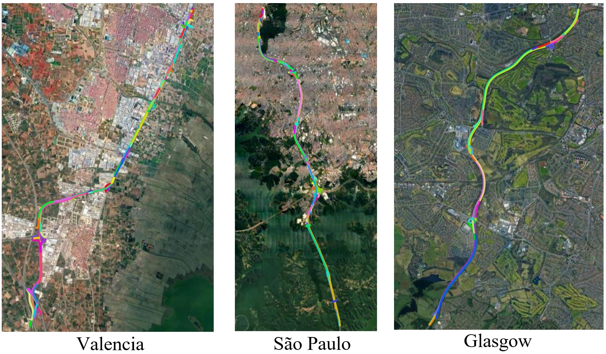

# Building Lane-Level Maps from Aerial Images
Official implementation for the ICASSP 2024 paper.

**Building Lane-Level Maps from Aerial Images**\
Jiawei Yao*, 
Xiaochao Pan*, 
Tong Wu, 
Xiaofeng Zhang

\* equal contribution


[](https://arxiv.org/abs/2312.13449)





## AerialLaneNet Requirements

1. Create conda environment:

```
$ conda create -y -n AerialLaneNet python=3.7
$ conda activate AerialLaneNet
```
2. This code is compatible with python 3.7, pytorch 1.7.1 and CUDA 10.2. Please install [PyTorch](https://pytorch.org/): 

```
$ conda install pytorch==1.7.1 torchvision==0.8.2 torchaudio==0.7.2 cudatoolkit=10.2 -c pytorch
```

## AErial Lane (AEL) Dataset 

### Description

AErial Lane (AEL) Dataset is a first large-scale aerial image dataset built for lane detection, with high-quality polyline lane annotations on high-resolution images of around 80 kilometers of road. The dataset contains 7,763 images and over 150,000 lanes covering different lane standards, terrain and regions, providing a comprehensive resource for researchers in this field.

### Dataset Details

we chose 11 regions, and each region consists of a road between 3 and 27 kilometers long with various backgrounds and terrain such as desert by the coastline in Dubai, urban area of Valencia and forest region in Perak State.

### Dataset Splits

Our split ratio of training set:validation set:test set is 7:2:1.

### AEL Dataset Downloads

Please download our dataset through this [link](https://drive.google.com/file/d/1fNTS4FrPbNUAWy6mdH9iqD3mYt7QHzIJ/view?usp=sharing)


## Citation

If you have any problem or suggestion, please feel free to open an issue or send emails to the contributors.

```
@inproceedings{yao2024building,
  title={Building lane-level maps from aerial images},
  author={Yao, Jiawei and Pan, Xiaochao and Wu, Tong and Zhang, Xiaofeng},
  booktitle={ICASSP 2024-2024 IEEE International Conference on Acoustics, Speech and Signal Processing (ICASSP)},
  pages={3890--3894},
  year={2024},
  organization={IEEE}
}

```
